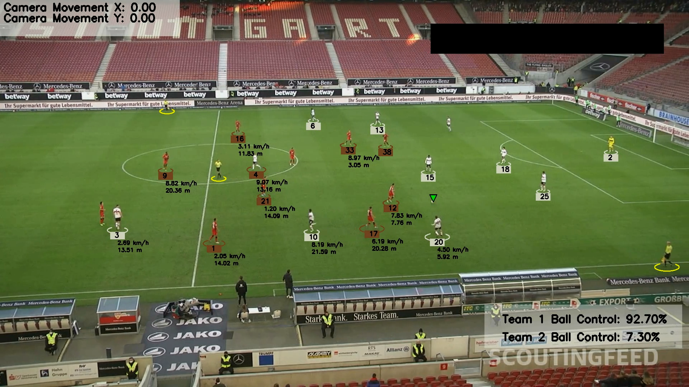

# Football Analysis Project

## About the Project
In this project, I used YOLO, a leading AI object detection model, to identify and track players, referees, and footballs in video footage. I further enhanced the model's accuracy through additional training. To distinguish players by team, I utilized Kmeans clustering for pixel segmentation based on t-shirt colors. This allowed me to calculate each team's ball possession percentage during a match. Additionally, I used optical flow techniques to track camera movement between frames, ensuring precise measurement of player movements. By applying perspective transformation, I converted the scene's depth and perspective, enabling me to measure player movements in meters instead of pixels. Ultimately, I determined each player's speed and the distance they covered during the game.

## Trained Models
- [Trained Yolo v8](https://drive.google.com/file/d/1clX2Ft9r_kkkSgfOkYOawHA_F2kZJypP/view?usp=drive_link)

## Sample video
- [Sample Output Video](https://drive.google.com/file/d/1zl83kZzqje_chhvUIx3w38AgZTkcox6o/view?usp=drive_link)

## Modules Used
- YOLO: AI object detection model
- Kmeans: Pixel segmentation and clustering to detect t-shirt color
- Optical Flow: Measure camera movement
- Perspective Transformation: Represent scene depth and perspective
- Speed and distance calculation per player

## Requirements
- Python 3.8 or above
- ultralytics
- supervision
- OpenCV
- NumPy
- Matplotlib
- Pandas

